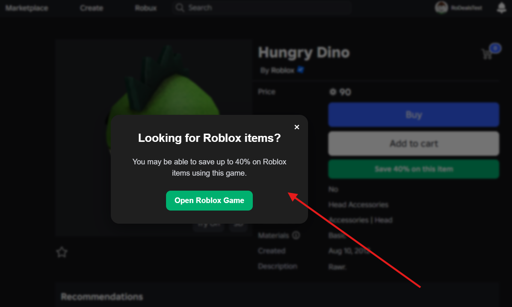
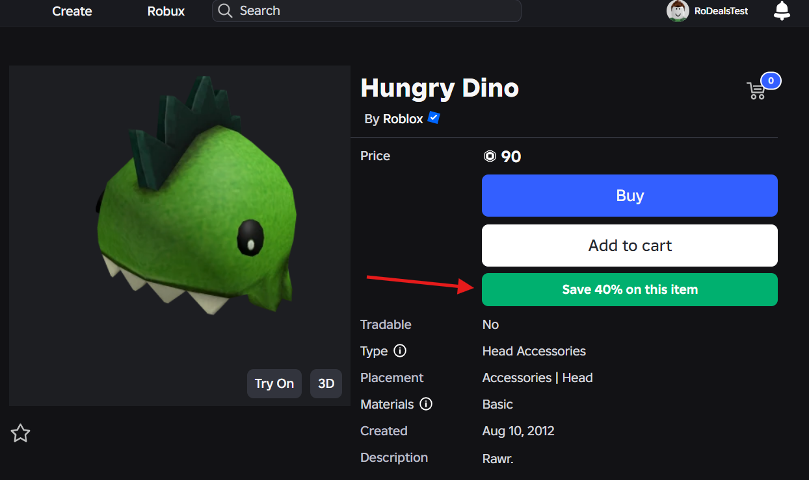
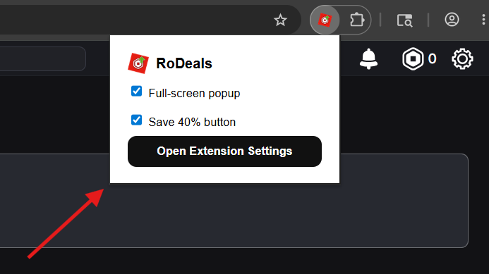
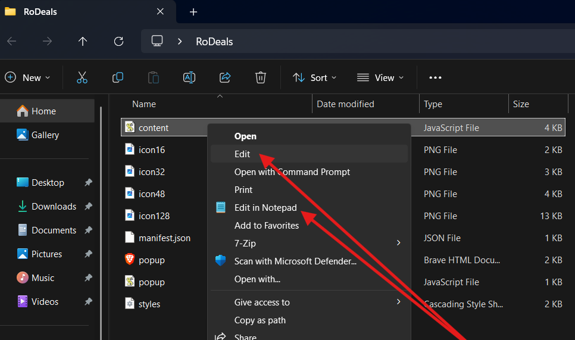
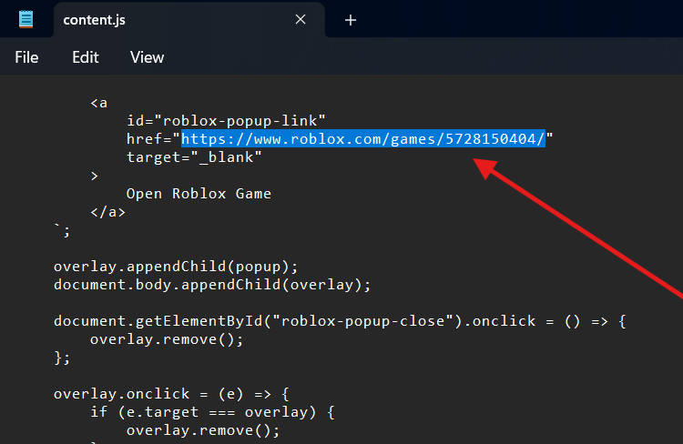
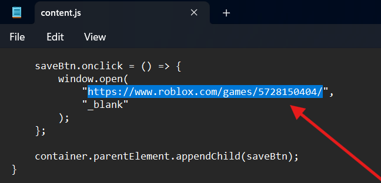
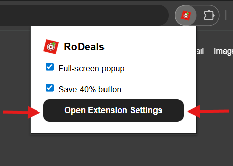
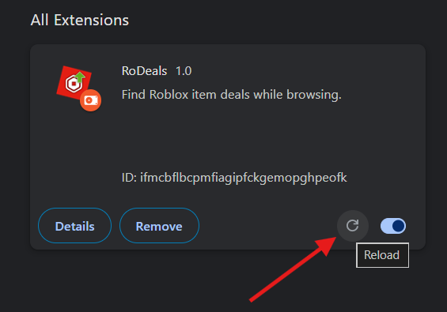

> [!CAUTION]
> The only official downloads for this extension are from this GitHub repository. Any other websites claiming to distribute this extension are not affiliated with this project.

> [!IMPORTANT]
> This extension is fully open source. All source code can be inspected directly in this repository.

<div align="center">


</div>

---

<p align="center">
  
</p>

<h1 align="center">
  RoDeals
</h1>

<p align="center">
  A lightweight browser extension for deal-hungry Roblox users.
</p>

A lightweight browser extension that helps remind Roblox users to discover potential Robux savings through the “40% method” - a technique where purchasing certain items can return up to 40% of the spent Robux through Roblox’s creator payout system. [Learn more here.](https://www.youtube.com/watch?v=Lyv93Odm0AQ)

Built with simplicity, transparency, and performance in mind.

## Features

- View reminders of Robux savings directly while browsing
- Clean and lightweight popup interface
- Fast performance with minimal resource usage
- Open source and fully inspectable
- Easy installation for Chromium-based browsers
- Roblox-themed user interface
- Simple and distraction-free design

## Screenshots

Full-screen website pop-up when clicking on an item.
<p align="left">
    
</p>

Save 40% button
<p align="left">
    
</p>

Extension pop-up
<p align="left">
    
</p>

## Frequently Asked Questions (FAQ)

### Is this extension safe?

Yes.

This extension is fully open source, meaning anyone can inspect the source code in this repository. The extension does not steal cookies, access your Roblox password, or collect sensitive account information.

Always make sure you're downloading the extension from an official source.

### Does this violate Roblox Terms of Service?

This extension is designed to enhance the browser experience only. It does not modify the Roblox client or interact with Roblox in the same way exploits or cheating software do.

### Does this extension access my account?

No.

The extension only uses the permissions necessary for its functionality. No login credentials or authentication tokens are collected or transmitted.

### Why is the extension requesting permissions?

Browser extensions require permissions to interact with webpages and display features. Every permission used by this extension is directly related to its intended functionality.

Because the project is open source, you can inspect exactly how permissions are used.

### How do I edit the extension to use my own Roblox game link?

> [!IMPORTANT]
> Make sure to save your changes in Notepad by going to **File → Save**.

You can customize the extension by replacing the default Roblox game link with your own.

**Step 1: Open the extension file**

After downloading the extension folder:

Locate the file named ```content.js```

Right-click it and select **Edit** or **Edit in Notepad**

<p align="left">
    
</p>

**Step 2: Update the full-screen pop-up link**

Find this section:

``` href="https://www.roblox.com/games/5728150404/" ```

Replace the URL with your own Roblox game link.

<p align="left">
    
</p>

**Step 3: Update the "Save 40%" button link**

Find this code:

```saveBtn.onclick = () => { ```
``` window.open(```
      ```"https://www.roblox.com/games/5728150404/",```
     ```"_blank"```
  ```);```
```};```

Replace the Roblox game URL with your own link.

<p align="left">
    
</p>

**Step 4: Reload the extension**

After making your changes:

- Open your browser’s Extensions page

You can either use the "Open Extension Settings" button when clicking on the extension icon

<p align="left">
    
</p>

### **OR**

Type the following in your search bar:
```text
chrome://extensions
```

- Find the extension

- Click the reload (refresh) icon

<p align="left">
    
</p>

*The extension should now use your custom game link.*

## Installation

1. Download the latest release [here](https://github.com/kay8o/RoDeals/releases/).

2. Open Chrome and navigate to:

```text
chrome://extensions
```

3. Enable **Developer Mode** in the top-right corner

4. Click **Load unpacked**

5. Select the extension folder

6. The extension should now appear in your browser toolbar

## Contributing

Pull requests, feature suggestions, and issue reports are welcome.

If you'd like to contribute:

1. Fork the repository
2. Create a new branch
3. Make your changes
4. Submit a pull request

Please keep code clean, readable, and documented when possible.

## Reporting Issues

> [!NOTE]
> This is a side project, so responses to bugs and feature requests may take some time.

Found a bug or have a feature request?

Please open an issue in the GitHub Issues section and include:
- browser version
- extension version
- steps to reproduce
- screenshots, if possible

## Privacy

This extension does **not**:
- collect passwords
- collect Roblox cookies
- track browsing history unrelated to Roblox
- sell user data
- inject advertisements

## Open Source

***Transparency matters.***

This project is fully open source so users can verify:
- how the extension works
- what permissions are used
- what code is executed

## License

This project is licensed under the MIT License.

See the [LICENSE](LICENSE) file for more information.

---

<p align="center">
    Made for the Roblox community by Kaylo. :3
</p>
